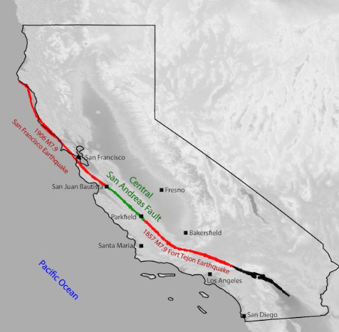

# Fort-Tejon-Earthquake-in-1857
Examining the 1857 Fort Tejon Earthquake to understand the future of the San Andreas fault in Northern Los Angeles County

The Fort Tejon earthquake occurred on January 9, 1857 on the San Andreas Fault, and is one of the largest earthquakes in California's recorded history. It was centered approximately 45 miles northeast of San Luis Obispo, near Parkfield, California, and its estimated magnitude was about 7.9 on the moment magnitude scale (Mw). The earthquake is also sometimes referred to as the Great Fort Tejon Earthquake or the 1857 Southern California Earthquake.

The earthquake occurred along the San Andreas Fault and lasted for about one to three minutes, which is a relatively long duration for an earthquake.

There were numerous aftershocks following the main event, some of which were strong enough to cause additional damage.

* The San Andreas fault is the longest fault in California and one of the longest strike-slip faults in the world.

* The largest foreshocks and aftershocks of the 1857 M 7.9 Fort Tejon earthquake occurring on the central and southern segments of the fault. The Fort Tejon earthquake caused significant ground displacement along the fault, with a maximum offset of approximately 9 meters (30 feet).

* Archived first-hand accounts from 1857 through 1862 were analyzed, grouping felt reports temporally and assigning modified Mercalli intensities to each site.

* A modified grid-search algorithm was used to find the location and magnitude of each event, consistent with assigned intensities.

* At least two foreshocks ("dawn" and "sunrise"), estimated at magnitudes M 6.1 and M ~ 5.6 respectively, were located on or near the Parkfield segment of the San Andreas fault before the main shock.

* The aftershock rate of the 1857 Fort Tejon main Earthquake was below average but within one standard deviation of expected numbers based on modern southern California sequences.

* Aftershocks included significant events with magnitudes ranging from M~6 to M~6.7, occurring near the southern half of the rupture and near San Bernardino and the Parkfield segment between December 1858 and April 1860.

* Based on logs at Fort Tejon, the aftershock sequence lasted a minimum of 3.75 years.

